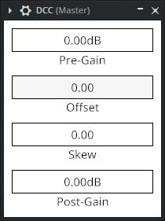

# DCC

A hard clipping distortion plugin with DC offset manipulation.

<div align="center">


</div>

## How does it sound?

The plugin was designed to make distortion as heard here simple to recreate: [leastfavorite! - CLIP!](https://x.com/leastfavorite_/status/1603546140011552768)

This has the advantage of creating a wide sounding bass tone, while preserving mono compatibility.

## Signal flow

1. Apply Pre-Gain
2. Apply Offset (add DC Offset to the signal)
3. Apply Skew (add DC Offset to the left channel, subtract DC Offset from the right channel)
4. Apply hard clipping
5. Revert Offset and Skew
6. Apply Post-Gain
7. Apply hard clipping

## Installation

1. Download the platform appropriate archive from the [releases page](https://github.com/edwloef/dcc/releases).
2. Extract the archive.
3. Copy the plugin in your desired format to your plugins folder.

## Building

To build the plugin, run the following command:

```bash
cargo xtask bundle dcc --release
```

To create universal bundles for MacOS, make sure you have both the `x86_64-apple-darwin` and `aarch64-apple-darwin` targets installed and run the following command:

```bash
cargo xtask bundle-universal dcc --release
```

The built bundles will be located in `./target/bundled/`
